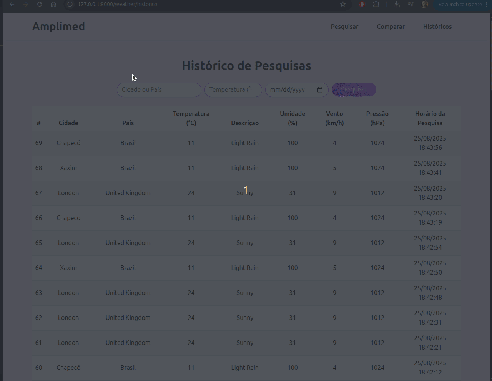

# Weather Forecast App

Aplicação desenvolvida em **Laravel** que consome a API **Weatherstack**
e utiliza **MySQL** para armazenar o histórico de pesquisas de clima.

## 🚀 Pré-requisitos

Antes de rodar o projeto, certifique-se de ter instalado:

-   [PHP](https://www.php.net/) (\>= 8.0)
-   [Composer](https://getcomposer.org/)
-   [Laravel](https://laravel.com/)
-   [MySQL](https://www.mysql.com/)

Também será necessário:

-   Criar um banco de dados no MySQL chamado **`weather_forecast`**
-   Criar uma conta no [Weatherstack](https://weatherstack.com/) e gerar
    um token de API
-   Definir o token no arquivo `.env` do Laravel:

``` env
KEY_WEATHERSTACK=seu_token_aqui
DB_CONNECTION=mysql
DB_HOST=127.0.0.1
DB_PORT=3306
DB_DATABASE=weather_forecast
DB_USERNAME=root
DB_PASSWORD=
```

## ⚙️ Instalação

Clone o repositório e instale as dependências:

``` bash
git clone https://github.com/seuusuario/weather-forecast.git
cd weather-forecast
composer install
cp .env.example .env
php artisan key:generate
```

Crie as tabelas no banco:

``` bash
php artisan migrate
```

Inicie o servidor local:

``` bash
php artisan serve
```

## 📂 Organização do Projeto

### Estrutura de Pastas

-   **`app/Http/Controllers`** → Controllers (ex.: `WeatherController`)
-   **`resources/views/dash`** → Views do dashboard e pesquisa
    individual
-   **`resources/views/compare`** → Views de comparação entre cidades
-   **`resources/views/history`** → Histórico de pesquisas
-   **`resources/views/components`** → Componentes reutilizáveis (ex.:
    `weatherCard`)
-   **`routes/web.php`** → Todas as rotas da aplicação

### Padrões Adotados

-   **Consistência visual** com Bootstrap (`rounded-pill`, `shadow-sm`,
    `btn-gradient`)
-   **Responsividade** (flex, grid, tabelas responsivas)
-   **Reutilização de componentes** (`x-weatherCard`)
-   **Tratamento de erros** com mensagens amigáveis
-   **Legibilidade**: código limpo e nomes claros
-   **Separação de responsabilidades**: controllers para lógica, views
    para apresentação

## 🖥️ Funcionalidades

-   Buscar clima atual por cidade
-   Comparar o clima de duas cidades
-   Consultar histórico de buscas
-   Interface responsiva e intuitiva


## Prévia do Sistema

Abaixo está uma prévia do sistema em ação, mostrando a interface de pesquisa de clima, comparação de cidades e histórico de consultas:




## 📜 Licença

Este projeto está sob a licença MIT.